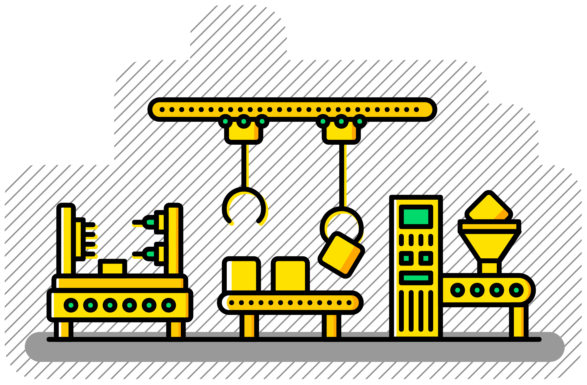
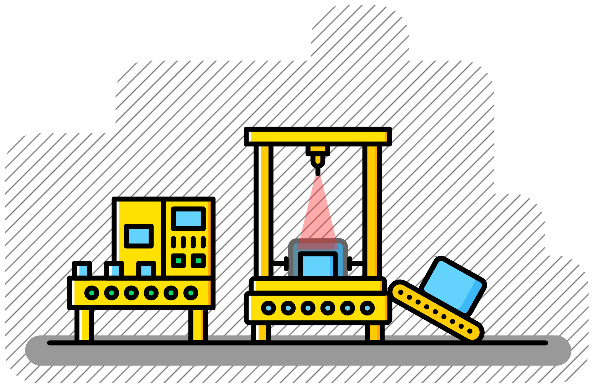
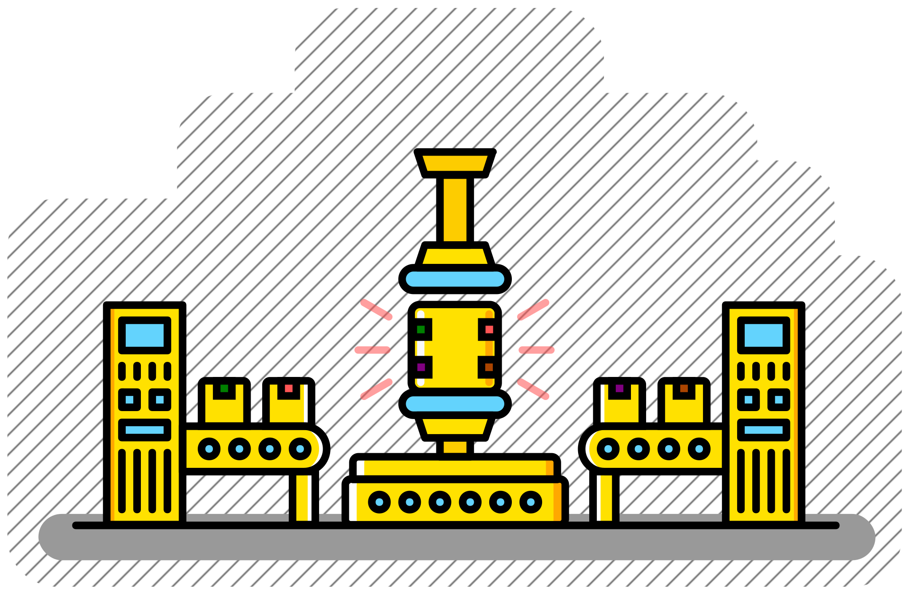

```{toctree}
:caption: Workflows
:maxdepth: 2
:hidden:

docs/workflows_by_stars
docs/workflows_by_watchers
docs/workflows_by_update
docs/workflows_by_tests
docs/workflows_by_topic
docs/all_standardized_workflows
docs/all_other_workflows
```

```{toctree}
:caption: About
:maxdepth: 2
:hidden:

docs/snakemake
docs/catalog
```

# Snakemake workflow catalog

<figure>
    
</figure>

The Snakemake Workflow Catalog aims to provide a regularly updated list of high-quality workflows that can be easily reused and adapted for various data analysis tasks. By leveraging the power of [**Snakemake**](https://snakemake.github.io/), these workflows promote:

::::{grid} 3
:::{grid-item-card} **Reproducibility**
Snakemake workflows produce consistent results, making it easier to share and validate scientific findings.

:::
:::{grid-item-card} **Scalability**
Snakemake workflows can be executed on various environments, from local machines to clusters and clouds.

:::
:::{grid-item-card} **Modularity**
Snakemake workflows allow easy customization and extension, enabling users to adapt them to their needs.

:::
::::

## Short cuts

::::{grid} 2
:::{grid-item-card}
:columns: auto
```{button-ref} docs/catalog
:ref-type: myst
:color: primary
Read Introduction - 5 min ⏱️
```
:::
:::{grid-item-card}
:columns: auto
```{button-ref} docs/all_standardized_workflows
:ref-type: myst
:color: primary
Explore workflows 🔭
```
:::
::::

## Contributing

- Improving PRs or issues with the workflow catalog (only the catalog, not the workflows themselves) can be made [here](http://github.com/snakemake/snakemake-workflow-catalog)
- Improving PRs or issues with the listed workflows can be made at the respective workflow repository (see individual [workflow pages](<docs/all_standardized_workflows>)).
- Resources for creating new workflows can be found [here](<docs/snakemake>) or in more detail on the [Snakemake documentation](https://snakemake.readthedocs.io/en/stable/index.html)
- New workflows will be [automatically added](<docs/catalog>) to the workflow catalog if they are contained in eligible Github repositories
