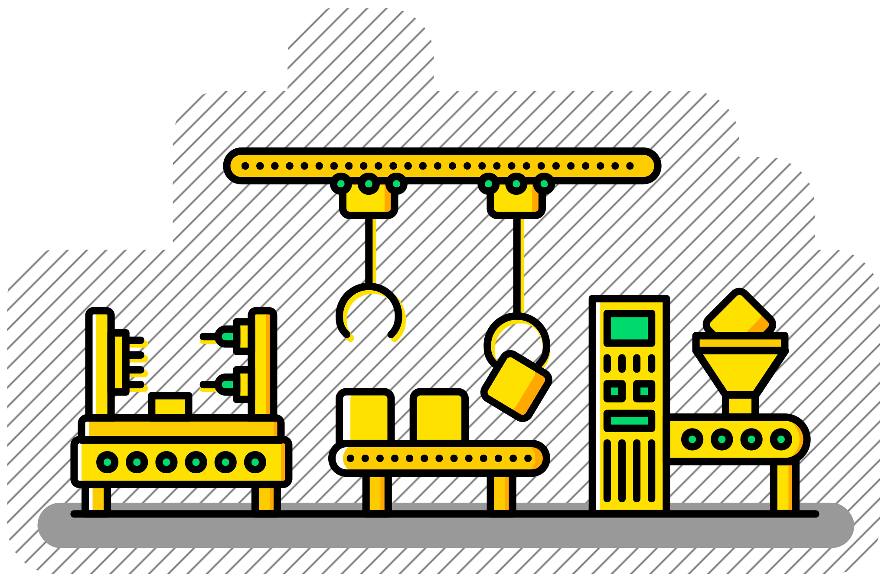
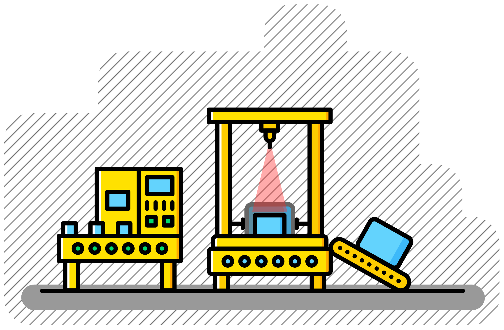

```{toctree}
:caption: Workflows
:maxdepth: 2
:hidden:

docs/workflows_by_stars
docs/workflows_by_watchers
docs/workflows_by_update
docs/workflows_by_tests
docs/workflows_by_topic
docs/all_standardized_workflows
docs/all_other_workflows
```

```{toctree}
:caption: About
:maxdepth: 2
:hidden:

docs/snakemake
docs/catalog
```

# Snakemake workflow catalog

## News

#### 2026-04-13

We are excited to launch **two new features** in the Snakemake Workflow Catalog that make automatic display of workflow pages both easier and more visually appealing:

1. The Catalog now supports automatic rendering of **Tube Maps** using [snakevision](https://github.com/OpenOmics/snakevision). Tube maps will automatically show up on your workflow page if the workflow has an executable test case in `.test` ([details](docs/about/adding_workflows)).

```{image} _static/news_item1.png
:alt: example tube map rendering
:width: 90%
:align: center
:class: rounded-img
```

2. The Catalog will automatically render a **Workflow Parameter Table** if your workflow repo contains a `workflow/schemas/config.schema.y(a)ml` or `config/schemas/config.schema.y(a)ml` ([details](docs/about/adding_workflows)). No need to manually maintain a table of parameters on your workflow page anymore.

```{image} _static/news_item2.png
:alt: example parameter table rendering
:width: 90%
:align: center
:class: rounded-img
```

## About

The Snakemake Workflow Catalog aims to provide a regularly updated list of high-quality workflows that can be easily reused and adapted for various data analysis tasks. By leveraging the power of [**Snakemake**](https://snakemake.github.io/), these workflows promote:

::::{grid} 3
:::{grid-item-card} **Reproducibility**
Snakemake workflows produce consistent results, making it easier to share and validate scientific findings.

:::
:::{grid-item-card} **Scalability**
Snakemake workflows can be executed on various environments, from local machines to clusters and clouds.

:::
:::{grid-item-card} **Modularity**
Snakemake workflows allow easy customization and extension, enabling users to adapt them to their needs.

:::
::::

## Short cuts

```{button-ref} docs/catalog
:ref-type: myst
:color: primary
:outline:
Read introduction - 5 min ⏱️
```

```{button-ref} docs/all_standardized_workflows
:ref-type: myst
:color: primary
:outline:
Explore workflows 🔭
```

```{button-link} https://github.com/snakemake/snakemake-workflow-catalog/issues
:color: primary
:outline:
Report issues or ideas on Github 📢
```

## Workflows in numbers

::::{grid} 1
:::{grid-item-card}

<iframe src="_static/chart_standardized.html" width="100%" height="175px"></iframe>
:::
:::{grid-item-card}
<iframe src="_static/chart_age_group.html" width="100%" height="175px"></iframe>
:::
:::{grid-item-card}
<iframe src="_static/chart_stargazers_count.html" width="100%" height="175px"></iframe>
:::
:::{grid-item-card}
<iframe src="_static/chart_subscribers_count.html" width="100%" height="175px"></iframe>
:::
:::{grid-item-card}
<iframe src="_static/chart_health.html" width="100%" height="175px"></iframe>
:::
:::{grid-item-card}
<iframe src="_static/chart_topic.html" width="100%" height="175px"></iframe>
:::
::::

## Contributing

- Improving PRs or issues with the workflow catalog (only the catalog, not the workflows themselves) can be made [here](http://github.com/snakemake/snakemake-workflow-catalog)
- Improving PRs or issues with the listed workflows can be made at the respective workflow repository (see individual [workflow pages](docs/all_standardized_workflows)).
- Resources for creating new workflows can be found [here](docs/snakemake) or in more detail on the [Snakemake documentation](https://snakemake.readthedocs.io/en/stable/index.html)
- New workflows will be [automatically added](docs/catalog) to the workflow catalog if they are contained in eligible Github repositories
